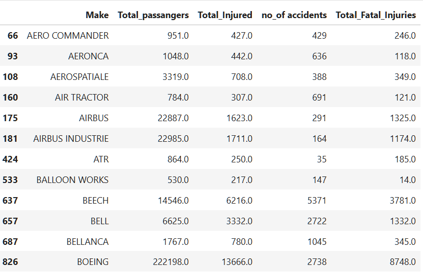
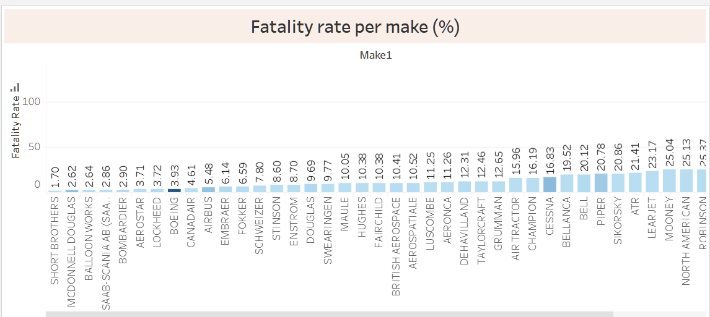
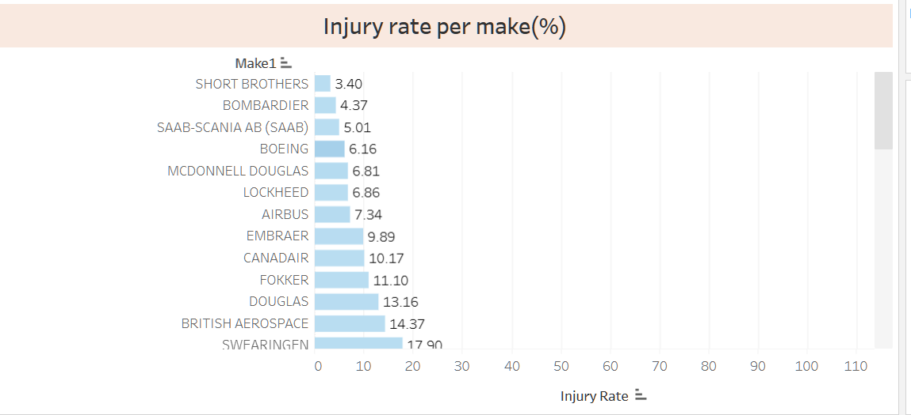
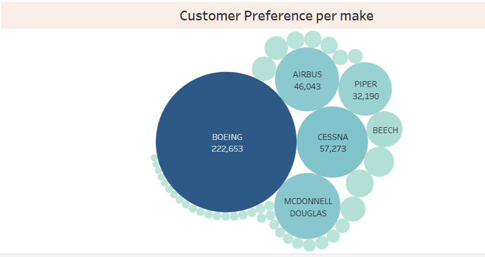

# **XYZ COMPANY AVIATION EXPANSION PROPOSAL**
## **Project Overview:**
In this project, I used data cleaning, imputation, analysis, and visualization processes to generate insights for the company management interested in venturing in airline business. 

## **Business Problem:**

XYZ company is expanding in to new industries to diversify its portfolio.  
They are interested in purchasing and operating airplanes for commercial and private enterprises, but do not know about the potential risks of aircraft.  
They seek to establish which aircraft have the lowest risk for the company to start this new business endeavor.  

## **Data Analysis:**
To  arrive at my recommendations, I utilized the  Aviation Accident Database & Synopses, up to 2023 available from Kaggle.com in the below link:  
https://www.kaggle.com/datasets/khsamaha/aviation-accident-database-synopses.

I used exploratory review to identify meaningful elements in the data that could guide  in developing key risk indicators for the company.
I focused on the below fields in the data:  
•	The make of the plane  
•	Total_Fatal_Injuries    per accident.  
•	Total_Serious_Injuries  per accident.  
•	Total_Minor_Injuries    per accident.  
•	Total_Uninjured  per accident.  

I found this meaningful in determining the number of passengers ferried per make.

## **Derived Key risk indicators for consinderation:**
I narrowed down in the below 3 key risk indicators:  
•	Injury rate per make of the aircraft.   
•	Fatality rate per make of the aircraft.  
•	Market dominance per make of the aircraft.
 

The analysis focused on data cleaning to refine the models.
I also undertook aggregation of passenger statistics and accident numbers per make of the aircraft.  

## **Assumptions made in the analysis:**

To arrive at meaningful analysis, I assumed that:  
•	For a make to be economically viable to operate , it  should have carried at least 500 passengers.  
•	The number of customers involved in the documented accidents is a representation of the market share per make.  
•	An injury/ fatality rate of 10% and below is acceptable to management.   
•	Company would seek to optimize returns by investing in makes with high market share.

 

## **Results:**
The outcome of the data cleaning and agrregation was a summarized data of accidents per make of the aircraft as below:

The data was  then visualized using Tableau.            
### **Risk rating by fatality rate**
Upon cleaning the data and filtering out makes with total passengers of 500 and above, the risk of fatality by plane was computed as by comparing the % of fatal injuries with the total injuries.  
The  data was the plotted in Tableau to identify the makes that had fatality rate of 10% and below.

The classifiaction of aircraft make by fatality rate was as below:  

### **Injury risk by make of aircraft**

The injury risk  to the passengers was derived as a percentage rate of passengers injured by aircraft make to the total passengers per aircraft.  
The clasisfication of aircaft make by injury rate was as summarised below:  

### **Customer preference per make**
Customer preference was deemed an important factor in sustaining revenue generation to the company. A such, a summary of the market share per make was provided to management. The summary was as below:

## **Recommendation**
Based on the analysis, **Boeng** has the highest market share for the company  to tap into.
with an injury rate of **6.16%** and fatality rate of **3.92%** the make presents a high opportunity to tap into with risks of passenger injury and fatality within the desired thresholds.

